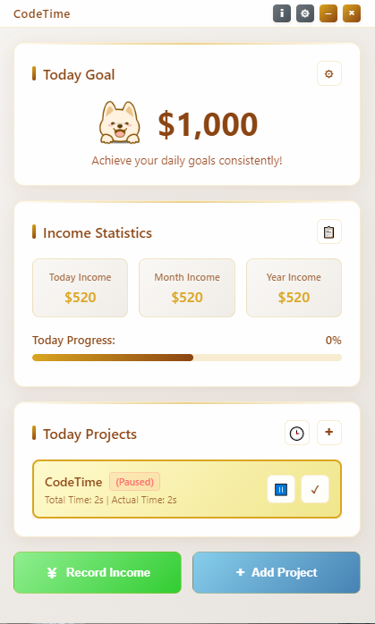
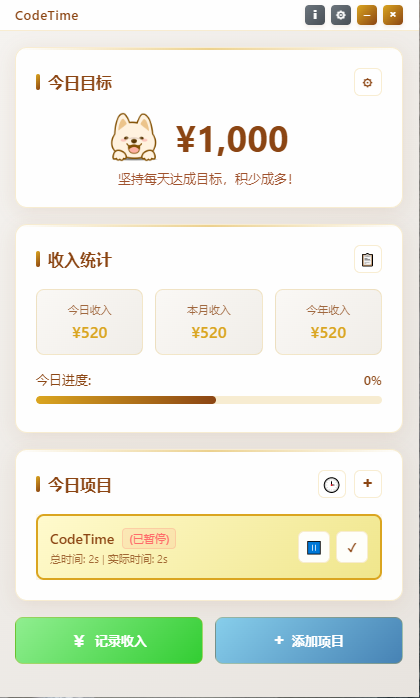

<div align="center">
  
  
  # CodeTime
  
  **🚀 Ultimate Time Tracking & Income Management Tool for Developers**

*Keywords: time tracker, productivity app, freelancer tools, developer productivity, income tracker, project management, electron app, coding timer*
  
  [](https://opensource.org/licenses/MIT)
  [](https://github.com/abnb0208/CodeTime/releases)
  [](https://github.com/abnb0208/CodeTime/releases)
  [](https://github.com/abnb0208/CodeTime/releases/latest)
  [](https://github.com/abnb0208/CodeTime)
  
  <h3>
    <a href="README.md">English</a> | 
    <a href="README_zh.md">🇨🇳 中文</a>
  </h3>
  
</div>

---

## 🎯 What is CodeTime?

**CodeTime** is a beautiful, cross-platform desktop application that revolutionizes how developers track their **coding time**, manage **project income**, and boost **productivity**. Built with modern **Electron** technology and featuring stunning **glassmorphism UI**.

### ⚡ Core Features

- 🕒 **Real-time Project Tracking** - Precise time tracking with pause/resume functionality
- 💰 **Income Management** - Track earnings, set daily goals, multiple currencies
- 📊 **Analytics Dashboard** - Comprehensive statistics and productivity insights
- 🎨 **Modern UI/UX** - Glassmorphism design with smooth animations
- 🌐 **Multi-language** - English & Chinese support
- 💾 **Data Export** - JSON, CSV, Excel export capabilities
- 🔔 **Smart Notifications** - Break reminders and goal notifications
- ⚡ **Cross-platform** - Windows, macOS, Linux support

---

## 📺 Demo Video & Screenshots

<div align="center">
  
  ### 🎥 Live Demo
  
  [](video_img/Video.mp4)
  
  *Watch CodeTime in action - see how easy it is to track time and manage income*
  
  <br/>
  
  ### 📸 Screenshots
  
  <table>
    <tr>
      <td align="center">
        <br/>
        <b>English Interface</b>
      </td>
      <td align="center">
        <br/>
        <b>中文界面</b>
      </td>
    </tr>
  </table>
  
</div>

---

## 🚀 Quick Start

### 📥 Download & Install

<div align="center">
  
  [](https://github.com/abnb0208/CodeTime/releases/latest)
  [](https://github.com/abnb0208/CodeTime/releases/latest)
  [](https://github.com/abnb0208/CodeTime/releases/latest)
  
</div>

### ⚡ Installation Options

> Coming in the future......

```bash
# Windows (Chocolatey)
choco install codetime

# macOS (Homebrew)
brew install --cask codetime

# Linux (Snap)
sudo snap install codetime
```

### 🛠️ Build from Source

```bash
git clone https://github.com/abnb0208/CodeTime.git
cd CodeTime
npm install
npm start          # Development
npm run build      # Production build
npm run dist       # Package for distribution
```

---

## 💡 Why Developers Love CodeTime?

### 🎯 For Freelancers
- **Accurate billing** with precise time tracking
- **Client invoicing** with detailed project reports
- **Income goal** tracking and achievement

### 👥 For Teams
- **Project analytics** and team productivity insights
- **Time allocation** analysis across features
- **Performance metrics** and development velocity

### 🧑‍💻 For Solo Developers
- **Productivity boost** with gamified tracking
- **Work-life balance** with break reminders
- **Financial awareness** of coding value

---

## 🏆 Key Highlights

<div align="center">
  
| Feature | Description |
|---------|-------------|
| ⚡ **Lightning Fast** | Electron-based with optimized performance |
| 🎨 **Beautiful Design** | Modern glassmorphism UI that developers love |
| 📊 **Smart Analytics** | AI-powered insights and productivity metrics |
| 🔒 **Privacy First** | Local data storage, no cloud dependency |
| 🌍 **Global Ready** | Multi-language and multi-currency support |
| 🚀 **Open Source** | MIT license, completely free forever |

</div>

---

## 🤝 Contributing

CodeTime is **100% open source** and welcomes contributions!

- 🐛 **Bug Reports** → [Open Issue](https://github.com/abnb0208/CodeTime/issues/new?template=bug_report.md)
- 💡 **Feature Requests** → [Suggest Feature](https://github.com/abnb0208/CodeTime/issues/new?template=feature_request.md)
- 🌍 **Translations** → Help us support more languages
- 💻 **Code** → Submit pull requests

Read our [Contributing Guide](CONTRIBUTING.md) for detailed instructions.

---

## 📄 License

**MIT License** - Free for personal and commercial use ✅

---

## 🌟 Show Your Support

If CodeTime boosts your productivity, please:

- ⭐ **Star this repo** - Help others discover it
- 🔄 **Share with friends** - Spread the word
- 💬 **Leave feedback** - Help us improve
- 🐛 **Report issues** - Make it better together

---

## 🔗 Links & Community

- **📖 Documentation** → [Wiki](https://github.com/abnb0208/CodeTime/wiki)
- **💬 Discussions** → [Community Forum](https://github.com/abnb0208/CodeTime/discussions)
- **🐛 Issues** → [Bug Reports](https://github.com/abnb0208/CodeTime/issues)
- **📧 Contact** → support@walleyx.com

---

<div align="center">
  
  **⭐ Star us on GitHub — it motivates us a lot!**
  
  [](https://star-history.com/#abnb0208/CodeTime&Date)
  
  ---
  
  Made with ❤️ by developers, for developers
  
  
  
</div>

---

<!-- SEO Keywords for better discoverability -->
<!--
time tracking app, developer productivity tools, freelancer time tracker, project time management, 
income tracking software, productivity app for developers, coding time tracker, work hours tracker,
electron desktop app, cross platform time tracker, project management tool, freelance billing software,
developer tools 2025, productivity software, time management app, coding productivity, 
programming time tracker, developer income tracker, project billing software, work time analyzer,
glassmorphism ui design, modern desktop app, open source time tracker, free productivity tools
--> 